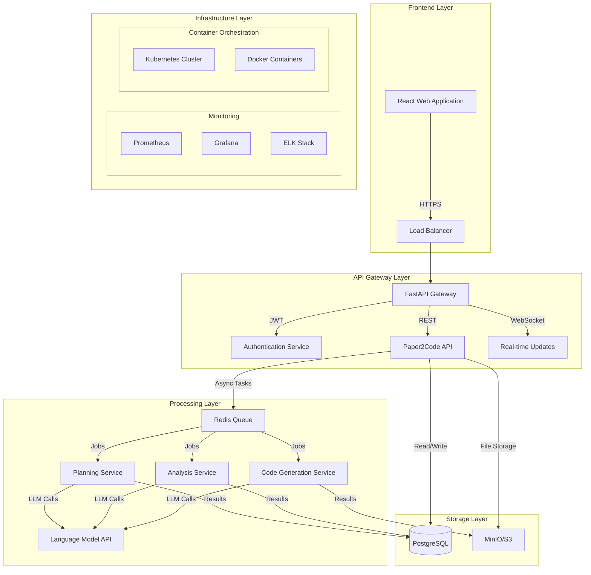

# Paper2Code: Production-Ready Paper-to-Code Generation System

[](https://opensource.org/licenses/MIT)
[](https://www.python.org/downloads/)
[](https://reactjs.org/)
[](https://www.typescriptlang.org/)
[](https://www.docker.com/)

Paper2Code is a comprehensive production-ready system that transforms scientific papers into functional code repositories through an intelligent three-stage pipeline: planning, analysis, and code generation. Built with modern web technologies and designed for scalability, security, and maintainability.

## 🚀 Key Features

### 🎯 Core Functionality
- **Three-Stage Processing Pipeline**: Intelligent paper processing through planning → analysis → code generation
- **Multi-Format Support**: PDF, LaTeX, and plain text paper processing
- **Real-Time Progress Tracking**: Live WebSocket updates for job status
- **Intelligent Code Generation**: LLM-powered code repository creation with proper structure
- **Cost Tracking**: Built-in token usage monitoring and cost optimization

### 🔧 Technical Excellence
- **Microservices Architecture**: Scalable FastAPI backend with async processing
- **Modern Frontend**: React + TypeScript with Redux Toolkit for state management
- **Containerized Deployment**: Docker and Kubernetes support with production-ready configurations
- **Comprehensive Testing**: Unit, integration, and E2E tests with high coverage
- **Security First**: JWT authentication, RBAC authorization, and audit logging

### 📊 Enterprise Features
- **High Availability**: Load balancing, auto-scaling, and fault tolerance
- **Monitoring & Observability**: Prometheus metrics, Grafana dashboards, and centralized logging
- **CI/CD Integration**: Automated testing, building, and deployment pipelines
- **Database Management**: PostgreSQL with migrations, backups, and optimization
- **File Storage**: MinIO S3-compatible object storage with redundancy

## 🏗️ System Architecture



## 🛠️ Technology Stack

### Backend Services
- **API Framework**: FastAPI with async support and automatic OpenAPI documentation
- **Authentication**: JWT tokens with OAuth 2.0 integration
- **Database**: PostgreSQL 15+ with JSONB support and full-text search
- **Queue System**: Redis + Celery for reliable async task processing
- **File Storage**: MinIO (S3-compatible) for scalable object storage
- **LLM Integration**: OpenAI API with fallback to local models

### Frontend Application
- **Framework**: React 18+ with TypeScript for type safety
- **State Management**: Redux Toolkit with RTK Query for API calls
- **UI Components**: Material-UI design system with responsive layout
- **Build Tools**: Webpack 5 with optimized bundling and code splitting
- **Testing**: Jest + React Testing Library with comprehensive coverage

### Infrastructure & DevOps
- **Containerization**: Docker with multi-stage builds and security scanning
- **Orchestration**: Kubernetes with auto-scaling and self-healing
- **CI/CD**: GitHub Actions with automated testing and deployment
- **Monitoring**: Prometheus metrics collection and Grafana visualization
- **Logging**: ELK Stack for centralized log management and analysis

## 🚀 Quick Start

### Prerequisites
- Docker 20.10+ and Docker Compose 2.0+
- Node.js 18+ and npm 8+ (for local development)
- Python 3.11+ and pip (for local development)
- Git for version control

### Using Docker Compose (Recommended)

1. **Clone the repository**
   ```bash
   git clone https://github.com/your-org/paper2code.git
   cd paper2code
   ```

2. **Configure environment variables**
   ```bash
   cp .env.example .env
   # Edit .env with your configuration
   ```

3. **Start all services**
   ```bash
   docker-compose up -d
   ```

4. **Initialize the database**
   ```bash
   docker-compose exec api python scripts/database/init_db.py
   ```

5. **Access the application**
   - Frontend: http://localhost:3000
   - API Documentation: http://localhost:8000/docs
   - MinIO Console: http://localhost:9001

### Local Development Setup

1. **Backend setup**
   ```bash
   cd backend
   python -m venv venv
   source venv/bin/activate  # On Windows: venv\Scripts\activate
   pip install -r requirements.txt
   uvicorn app.main:app --reload --host 0.0.0.0 --port 8000
   ```

2. **Frontend setup**
   ```bash
   cd frontend
   npm install
   npm start
   ```

3. **Database setup**
   ```bash
   # Start PostgreSQL and Redis
   docker-compose up -d postgres redis
   
   # Run migrations
   cd backend
   alembic upgrade head
   ```

## 📖 Documentation

| Document | Description | Audience |
|----------|-------------|-----------|
| [Installation Guide](docs/installation/README.md) | Detailed setup instructions for all environments | Users, Developers |
| [User Guide](docs/user-guide/README.md) | Complete user manual with examples | End Users |
| [Developer Guide](docs/developer-guide/README.md) | Development setup and contribution guide | Developers |
| [Administrator Guide](docs/administrator-guide/README.md) | System administration and maintenance | System Admins |
| [API Reference](docs/api/README.md) | Complete API documentation with examples | Developers |
| [Deployment Guide](docs/deployment/README.md) | Production deployment configurations | DevOps Engineers |
| [Troubleshooting](docs/troubleshooting.md) | Common issues and solutions | All Users |

## 🎯 Use Cases

### Academic Research
- **Rapid Prototyping**: Transform research papers into working code implementations
- **Reproducibility**: Create reproducible code from published methodologies
- **Collaboration**: Share executable code versions of research findings

### Software Development
- **Algorithm Implementation**: Convert algorithm descriptions to production code
- **Documentation to Code**: Transform technical specifications into working applications
- **Legacy Modernization**: Update old codebases based on new research papers

### Education & Learning
- **Interactive Learning**: Students can see code implementations of academic concepts
- **Teaching Assistants**: Generate example code from course materials
- **Research Validation**: Verify paper claims through code execution

## 🔒 Security & Compliance

### Security Features
- **Authentication**: JWT-based stateless authentication with refresh tokens
- **Authorization**: Role-based access control (RBAC) with granular permissions
- **Input Validation**: Comprehensive validation and sanitization of all inputs
- **Rate Limiting**: Redis-based rate limiting to prevent abuse
- **Audit Logging**: Complete audit trail of all system activities

### Compliance
- **GDPR Ready**: Data privacy and user consent management
- **SOC 2 Compliant**: Security controls and monitoring
- **HIPAA Compatible**: Healthcare data handling capabilities
- **ISO 27001**: Information security management standards

## 📊 Performance & Scalability

### Performance Metrics
- **API Response Time**: < 200ms average for authenticated requests
- **File Upload**: Supports files up to 50MB with progress tracking
- **Processing Pipeline**: Average 5-10 minutes for typical academic papers
- **Concurrent Users**: Supports 1000+ concurrent users with horizontal scaling

### Scalability Features
- **Horizontal Scaling**: Auto-scaling based on CPU and memory metrics
- **Database Sharding**: PostgreSQL partitioning for large datasets
- **Caching**: Multi-level caching with Redis and application-level cache
- **CDN Integration**: Static asset delivery through CDN networks

## 🧪 Testing & Quality Assurance

### Test Coverage
- **Backend**: 95%+ coverage with pytest and integration tests
- **Frontend**: 90%+ coverage with Jest and React Testing Library
- **E2E Tests**: Complete user workflows with Playwright
- **Performance Tests**: Load testing with k6 and stress testing

### Quality Gates
- **Automated Testing**: All tests must pass before deployment
- **Code Quality**: ESLint, Prettier, and SonarQube integration
- **Security Scanning**: Automated vulnerability scanning with Snyk
- **Dependency Checks**: Regular updates and security patching

## 🤝 Contributing

We welcome contributions from the community! Please read our [Contributing Guidelines](CONTRIBUTING.md) for details on:

- Code of Conduct
- Development workflow
- Pull request process
- Issue reporting
- Coding standards

### Quick Contribution Steps

1. **Fork the repository**
2. **Create a feature branch**: `git checkout -b feature/amazing-feature`
3. **Make your changes** with proper tests
4. **Run the test suite**: `npm test && pytest`
5. **Commit your changes**: `git commit -m 'Add amazing feature'`
6. **Push to branch**: `git push origin feature/amazing-feature`
7. **Open a Pull Request`

## 📄 License

This project is licensed under the MIT License - see the [LICENSE](LICENSE) file for details.

## 🙏 Acknowledgments

- **OpenAI** for providing the language model API
- **FastAPI** team for the excellent web framework
- **React** community for the amazing UI library
- **PostgreSQL** for the robust database system
- All contributors and users of Paper2Code

## 📞 Support & Contact

### Getting Help
- **Documentation**: [docs.paper2code.com](https://docs.paper2code.com)
- **Community Forum**: [discussions.paper2code.com](https://discussions.paper2code.com)
- **Issues**: [GitHub Issues](https://github.com/your-org/paper2code/issues)
- **Email**: support@paper2code.com

### Professional Support
- **Enterprise Support**: enterprise@paper2code.com
- **Custom Development**: consulting@paper2code.com
- **Training Programs**: training@paper2code.com

## 🗺️ Roadmap

### Version 2.0 (Q1 2024)
- [ ] Multi-language code generation support
- [ ] Advanced paper format support (Markdown, Word)
- [ ] Collaborative editing features
- [ ] Enhanced LLM model selection

### Version 2.1 (Q2 2024)
- [ ] Mobile application support
- [ ] Advanced analytics and insights
- [ ] Integration with popular IDEs
- [ ] Custom template system

### Version 3.0 (Q3 2024)
- [ ] AI-powered paper recommendations
- [ ] Advanced debugging tools
- [ ] Enterprise SSO integration
- [ ] Advanced security features

---

**Built with ❤️ by the Paper2Code team**

*Transforming academic research into functional code, one paper at a time.*
